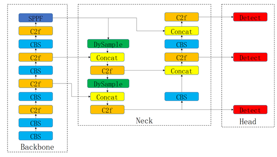

# CV-task

#### 介绍
Using dysample operator to improve yolov8 for road disease detection in computer vision

#### 软件架构
将Dysample算子[1]应用到YOLOv8中提升道路病害检测效果



#### 使用说明

1.  环境配置（遵循YOLOv8官方文档）
[YOLOv8官方文档](https://docs.ultralytics.com/)

2.  准备RDD2022数据集，从[百度网盘](https://pan.baidu.com/s/1HfNSejaVJ9ZdXTGO2NrSDg?pwd=1q5z)中下载后，放入v8_dysample/ultralytics-main/ultralytics/models/yolo/detect/datasets路径下


3.  训练模型，终端输入

```
python v8_dysample/ultralytics-main/train.py
```


4.  视频讲解（2023201237-宋星晴.mp4）


#### 参考文献
[1] Liu W, Lu H, Fu H, et al. Learning to Upsample by Learning to Sample[C]//Proceedings of the IEEE/CVF International Conference on Computer Vision. 2023: 6027-6037. 
